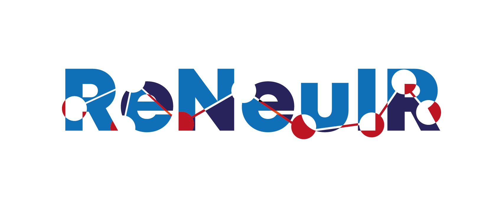

The ReNeuIR Workshop aims to foster discussion and collaboration
on holistic evaluation of methods in the age of neural information
retrieval (NIR), noting that efficacy matters but so does the computational
cost incurred to achieve it. In particular, the workshop promotes
the following notions and encourages the community to raise and
debate questions on the following themes:

* **Justification**: We believe it is important to justify
the ever-growing model complexity through appropriate empirical analysis.

* **Training and inference efficiency**: We encourage the
development of models that require less data or computational
resources for training and fine-tuning, and that offer similarly
fast inference. We also ask if there are meaningful simplifications
of the existing training processes or model architectures that lead
to comparable quality.

* **Evaluation and reporting**: We draw attention to the lessons
learnt from past information retrieval studies and encourage a multi-faceted
evaluation of NIR models from quality to efficiency, and
the design of reusable benchmarks and standardized metrics.
