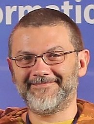

# Keynote Speakers

We are very excited to have [Djoerd Hiemstra](https://scholar.google.de/citations?user=SN0MvYwAAAAJ&hl=en) and [Nicola Tonellotto](https://scholar.google.de/citations?user=mTVRtZQAAAAJ&hl=en) as
keynote speakers for ReNeuIR 2025! Below you find the titles and abstracts of their keynotes.

-------

## Djoerd Hiemstra

### On the Neural Hype and Improving Efficiency of Sparse Retrieval

### Abstract
"The Neural Hype, Justified!" exclaimed Jimmy Lin in an opinion paper in the SIGIR Forum of December 2019. But is it really? Effectiveness-wise, maybe not: I will share some recent examples that show that neural rankers on new data do not even significantly improve a weak sparse baseline. If they do improve on old data, some neural rankers have been per-trained on the test data -- the ultimate sin of the machine learning professional --  convincingly shown for the MovieLens data in the SIGIR 2025 poster of Dario Di Palma and colleagues: "Do LLMs Memorize Recommendation Datasets?" Efficiency-wise, neural rankers are no match to sparse rankers. The standard BERT (re-)ranker hailed by Lin's SIGIR Forum paper may be as much as 10 million times as inefficient as a sparse ranker (Yes, you read that right). I will show some recent innovations for improving the efficiency of sparse rankers: The score-fitted index and the constant-length index (a SIGIR 2025 poster too!) which are implemented in Zoekeend, a new experimental search engine based on the relational database engine DuckDB and available from: https://gitlab.science.ru.nl/informagus/zoekeend/

-------

## Nicola Tonellotto

### The Silence of the Docs - Static and Dynamic Pruning for Efficient Neural Retrieval

#### Abstract

Neural retrieval models now achieve remarkable effectiveness, yet their appetite for computation threatens practical deployment at web-scale. By contrast, classical search engines built on inverted indexes enjoy decades of research and engineering that lets them answer billions of queries per day across vast clusters with ease. Over the years, many of those efficiency benefits –- from index pruning to early-termination heuristics —- have been adapted to both dense and sparse neural rankers, with mixed success.

This keynote traces that lineage. We will examine the core processing strategies inherited from traditional IR and show how they translate to modern neural pipelines, spotlighting static and dynamic pruning. In these methods, documents unlikely to matter are “silenced” —- discarded offline during indexing or skipped online during query processing —- dramatically reducing latency and cost while preserving quality. We will provide empirical insights into what works (and why), and open challenges for the next generation of efficient neural retrieval systems.

